<h1 align="center">Hi 👋, I'm Eshaan Bobdey</h1>
<h3 align="center">Engineering Student • Developer • Machine Learning Enthusiast</h3>

  
  
  

---

### 🚀 About Me

- 🎓 Fourth-year IT student with a strong academic record (**CGPA: 8.48**)
- 🏅 Dean's List honoree — 3rd, 4th, and 5th semesters
- 💻 Focused on **Web Development** and **Machine Learning**
- ⚙️ Currently learning **Java** and sharpening backend development skills
- 🏥 Built real-world projects spanning **healthcare** and **web systems**
- 🔬 Exploring **Federated Learning** and scalable ML systems
- 📫 Open to collaborating on ML, backend, or full-stack projects

---

### 🌟 Featured Project

<table>
  <tr>
    <td width="120" align="center">🩺</td>
    <td>
      <h3>Federated Sepsis Detection System</h3>
      

        A privacy-preserving federated learning platform for early sepsis prediction
        across hospitals — hospitals share only model weights, never raw patient data.
      

      <ul>
        <li>FastAPI backend with Google OAuth + JWT auth and role-based access</li>
        <li>NumPy-based FedAvg-style weight aggregation across participants</li>
        <li>Async PostgreSQL data layer, deployed on Render + Netlify</li>
      </ul>
      <a href="https://github.com/eshaanbobdey/federated_sepsis_website">🔗 View Project</a>
    </td>
  </tr>
</table>

---

### 🛠️ Tech Stack

**Languages & Core**

**Web Development**

**Machine Learning & Data**

**Data & Backend**

**Visualization & Apps**

**Tools**

---

### 📊 GitHub Stats

  

  

> These cards are static SVGs generated once a day by a GitHub Action in this repo (`.github/workflows/update-readme-cards.yml`), not live calls to a shared public API — so they won't break from someone else's rate limit.

---

### 🤝 Connect with Me

  
  
  

---

<i>⭐️ Thanks for stopping by — always happy to connect and collaborate!</i>

